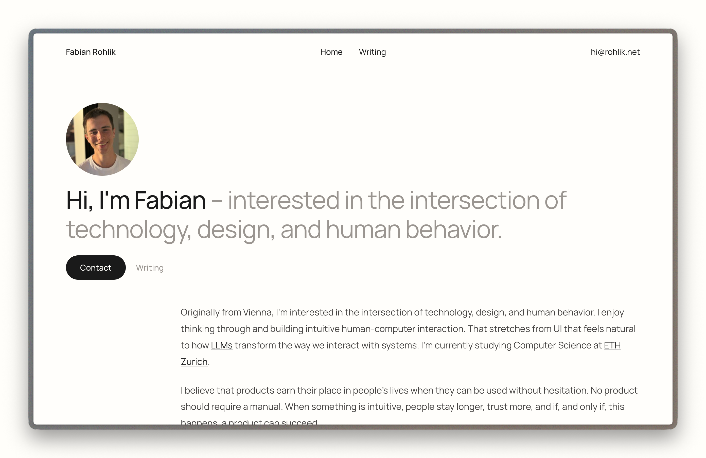
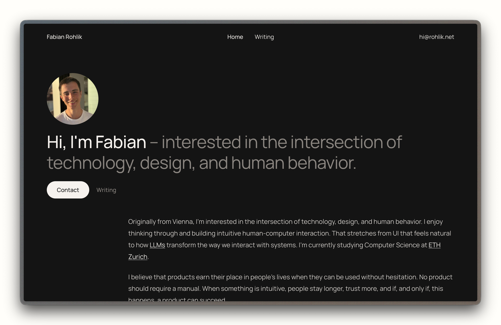

# Portfolio Theme

The WordPress classic theme used on my portfolio website. Uses Lenis, GSAP and the Manrope font (all local). Adds Photography and Projects custom post types. The Caveat font is included for possible future additions. 

## Preview

| Light Mode | Dark Mode |
|:---:|:---:|
|  |  |

## How-To's

The portrait photo on the homepage is set through the featured image of the page. Text on the homepage is set through the page content, the hero title is set through HTML (for now), same with the footer. Navigation is managed through the WordPress menu.

## Installation

1. Copy the `fabian-theme` directory to `wp-content/themes/`.
2. Activate via WordPress Admin > Appearance > Themes.
